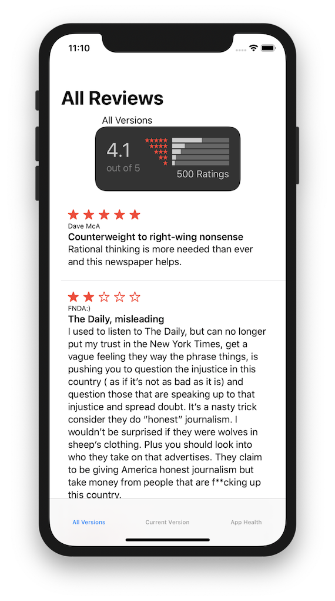
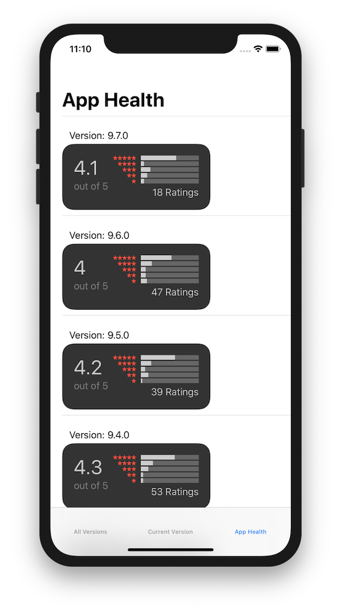

# Top Rated App Store Reviews Demo (Combine and SwiftUI)

Paul Solt

Paul@SuperEasyApps.com

https://SuperEasyApps.com

Top Rated demo SwiftUI + Combine app was created for my [try! Swift New York 2019 Workshop: "Super Easy Combine"](https://www.tryswift.co/events/2019/nyc/#paulsolt)

It will pull down App Store reviews and visualizes the content in both a star rating widget (SwiftUI) and a list view for browsing.

The code is prototype code and MIT license—to switch apps, change the `appId` in the "SceneDelegate.swift" file.

